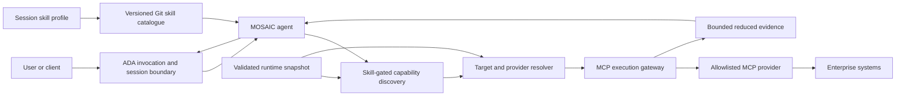
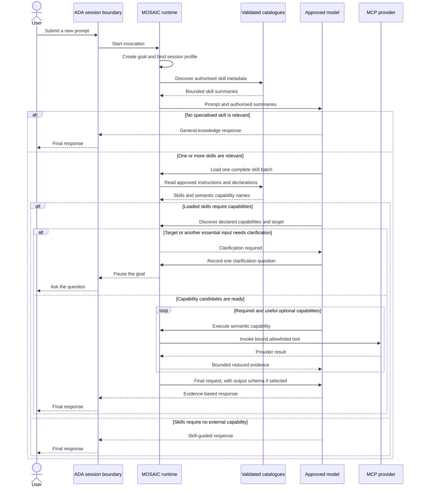
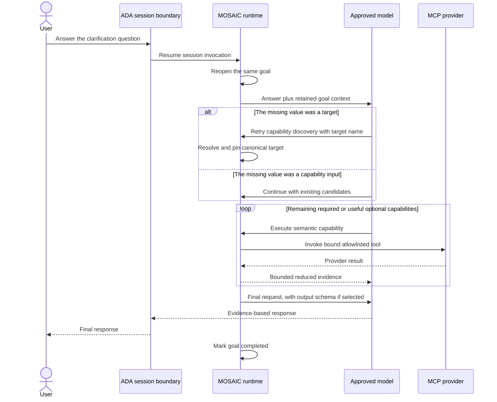
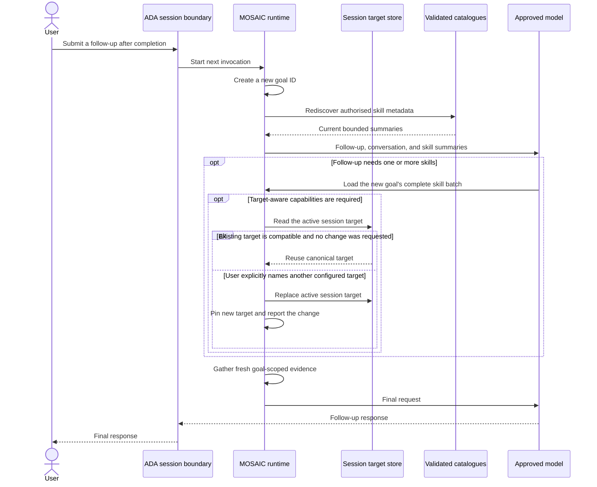

# MOSAIC

MOSAIC is a governed enterprise agent for investigating operational systems
through approved procedures and tools. It combines general language-model
reasoning with versioned **skills**, semantic **capabilities**, and controlled
Model Context Protocol (MCP) providers.

MOSAIC is currently an MVP under active development. Its strongest working
path is read-only investigation of container platforms and observability data.
It also contains demonstration skills for IBM MQ diagnosis, database-runbook
matching, structured JSON output, and non-technical summaries.

> **Important:** the current live-provider setup is a single-user development
> demonstration. It does not yet provide production-grade authentication,
> tenant isolation, delegated MCP authorization, or resource-level RBAC.

## The problem MOSAIC addresses

Enterprise support teams often have procedures in documents, diagnostic data
behind several tools, and platform knowledge spread across specialist teams.
A general-purpose AI assistant may be able to reason about a problem, but it
does not inherently know:

- which operational procedure is approved;
- which systems a particular user or workspace may access;
- how a business-level request maps to a concrete provider tool;
- which environment the user means;
- how to constrain large or sensitive provider responses; or
- how to distinguish evidence from a plausible-sounding assumption.

MOSAIC introduces governed layers between the language model and operational
systems. The model works with approved semantic concepts while trusted runtime
code controls provider selection, arguments, routing, limits, and execution.

```text
User goal
   ↓
Authorised skill (approved procedure)
   ↓
Semantic capability (required outcome)
   ↓
Validated target and provider binding
   ↓
Bounded read-only MCP request
   ↓
Reduced evidence and a qualified response
```

This separation is designed to make an investigation reviewable, portable
between providers, and safer than exposing raw tools or endpoints directly to
the model.

## Core concepts

| Concept | Meaning |
| --- | --- |
| **Goal** | One complete unit of user work, including its selected skills, target, and capability outcomes. |
| **Skill** | Versioned guidance describing when and how to perform a procedure or present an answer. |
| **Capability** | A provider-neutral outcome such as `kubernetes.pods.running.count`. |
| **Provider** | A configured MCP endpoint with an exact allowlist of callable tools. |
| **Target** | A stable identity for a deployed environment, such as `openshift/uk-dev`. It is not an endpoint. |
| **Binding** | Trusted configuration mapping a semantic capability to provider arguments and result handling. |
| **Runtime snapshot** | One immutable JSON document containing the active targets, providers, capabilities, and bindings. |
| **Skill profile** | The set of skills authorised for an ADA session. |

Skills are the capability-exposure boundary. Selecting a target may choose the
right provider for a capability, but it must never grant additional
capabilities that were not declared by the selected skills.

## How MOSAIC works

### High-level architecture

For each new goal, MOSAIC follows a progressive-disclosure flow:

1. The runtime exposes a bounded summary of the skills authorised for the
   current session.
2. The model selects and loads the complete relevant skill set once.
3. MOSAIC exposes only the semantic capabilities declared by those skills.
4. When required, a user-supplied target name or alias is resolved to a
   configured canonical target.
5. Trusted runtime code chooses the compatible provider, maps semantic inputs
   to concrete tool arguments, and injects protected routing values.
6. The MCP result is checked and reduced according to its configured result
   binding before evidence reaches the model.
7. Required capability outcomes are tracked for the goal. MOSAIC prevents a
   final answer while a required capability remains incomplete.
8. An output skill may constrain the final answer, for example as JSON or as a
   plain-language stakeholder summary.



Provider endpoints, concrete tool names, fixed arguments, credentials, and
provider-specific routing values remain outside the skill text and model
prompt.

### Interaction workflows

The following diagrams separate the three session interactions that matter to
users. A **clarification reply** continues the same goal. A **follow-up after a
completed response** starts a new goal, even though it remains in the same ADA
session.

#### Interaction 1: a new prompt

Every new goal receives a new goal ID. MOSAIC binds the session's trusted skill
profile and forces bounded skill discovery before the model can choose any
tool. A goal that needs external evidence follows the governed capability path;
a general-knowledge goal can answer without loading a skill.



If the model attempts to finish while a required capability is still pending,
the runtime replaces that response with an internal continuation call. The
user sees only the completed response or an explicit clarification question.

#### Interaction 2: replying to a clarification

A clarification reply resumes the existing goal with a new invocation ID. The
goal ID, loaded skill batch, declared capabilities, and any completed required
outcomes are retained. Skill discovery and skill loading are not repeated.



At present, a new user message received while MOSAIC is awaiting clarification
is treated as an answer to that clarification. Reliably detecting that the user
has abandoned the question and started a different goal is planned work.

#### Interaction 3: a follow-up after completion

Once a response has completed, the next user message starts a new goal. MOSAIC
performs skill discovery again because the follow-up may require a different
procedure or output. The session's authorised profile and resolved target may
be reused, but previous capability outcomes cannot satisfy the new goal.



Conversation history can help the model interpret a follow-up, but trusted
completion state is isolated by goal ID. Changing target also requires fresh
target-bound evidence; MOSAIC never carries a previous target's execution
outcomes into the new goal.

## Example use cases

### Container-platform investigation

A user can ask MOSAIC to investigate an unhealthy workload, a stalled rollout,
an OpenShift ingress problem, a service-connectivity failure, or a storage
failure. A relevant skill directs the investigation while capabilities obtain
only the necessary pod, controller, event, detail, log, network, or storage
evidence.

Example:

> Investigate why the payments deployment is not ready in namespace
> `payments-prod` on the UK development OpenShift cluster over the last 30
> minutes.

### Bounded workload inventory

MOSAIC can answer focused inventory questions without automatically expanding
them into a full diagnostic exercise.

Example:

> How many running pods are in namespace `order-api`?

The capability can require a namespace, apply a fixed running-state filter,
count the returned collection, and expose only the scope and count to the
model.

### Observability correlation

A time-bounded observability skill can quantify HTTP latency, response classes,
connection errors, resource pressure, or restarts and correlate them with
platform evidence. Provider query languages remain hidden in the capability
binding.

### Governed runbook matching

A database request can be mapped to an approved, versioned runbook through a
governed retrieval provider. The intended use case selects and explains the
runbook; it does not execute the procedure.

### Different outputs from the same evidence

Procedural skills and output skills can be selected together. The same
investigation can produce schema-conformant JSON for automation or a concise
plain-language summary for service owners and executives.

## Configuration overview

MOSAIC currently uses three main configuration areas:

| Area | Current source | Purpose |
| --- | --- | --- |
| Model and runtime | Environment variables | Connect ADA to the approved model and apply runtime limits. |
| Skills | Versioned Git repository | Store reviewable procedures, output guidance, and semantic capability requirements. |
| Capabilities and providers | Versioned JSON runtime snapshot | Define targets, MCP endpoints, tool allowlists, semantic mappings, routing, and evidence limits. |

The capability runtime snapshot is currently a deployment-managed JSON file.
It is an interim publication format, not the intended long-term authoring and
governance interface.

### Required model settings

| Environment variable | Purpose |
| --- | --- |
| `LLM_PROXY_URL` | Base URL of the organisation's AI Access Layer. |
| `LLM_MODEL` | Model selected through that access layer. |
| `AGENT_IDENTIFIER` | Trusted MOSAIC agent identity sent as `x-agent-id`. This is not end-user identity. |

### Skill catalogue settings

| Environment variable | Purpose |
| --- | --- |
| `MOSAIC_SKILLS_REPOSITORY_URL` | URL of the Git skill catalogue. |
| `MOSAIC_SKILLS_REPOSITORY_REVISION` | Branch, tag, or revision to activate; defaults to `main`. |
| `MOSAIC_SKILLS_REPOSITORY_CACHE_PATH` | Deployment-local bare Git cache. |
| `MOSAIC_SKILLS_REPOSITORY_ACCESS_TOKEN` | Repository Bearer token; required and never stored in the catalogue snapshot. |
| `MOSAIC_SKILLS_SYNCHRONIZATION_TIMEOUT_SECONDS` | Maximum controlled synchronisation time. |

Skill access is configured with JSON-valued environment variables. For
example:

```text
MOSAIC_SKILLS_PROFILES={"platform-team":["inspect-container-platform-workloads","investigate-workload-degradation"],"read-only-summary":["summarize-technical-findings"]}
MOSAIC_SKILLS_DEFAULT_PROFILE_ID=platform-team
MOSAIC_SKILLS_SESSION_PROFILE_ASSIGNMENTS={"example-session":"read-only-summary"}
```

Profiles control which skill metadata a session can discover. They are not a
replacement for authenticated user identity or resource-level authorization.

Additional settings bound the number and size of discoverable and loaded
skills:

- `MOSAIC_SKILLS_MAXIMUM_ENABLED_SKILL_COUNT`
- `MOSAIC_SKILLS_MAXIMUM_DISCOVERY_METADATA_CHARACTERS`
- `MOSAIC_SKILLS_MAXIMUM_LOADED_SKILL_COUNT`
- `MOSAIC_SKILLS_MAXIMUM_LOADED_SKILL_CHARACTERS`

The [skill package format](app/mosaic/SKILL_PACKAGE_FORMAT.md) describes the
required `SKILL.md` and `mosaic.yaml` files, package hierarchy, validation, and
progressive-disclosure rules.

## The capability runtime snapshot

Set `MOSAIC_CAPABILITY_RUNTIME_SNAPSHOT_PATH` to the absolute path of the JSON
file to load. The complete file is validated at startup and rejected if it is
missing, malformed, too large, internally inconsistent, or references an
unapproved provider/tool combination.

The current document structure is:

```json
{
  "schema_version": 3,
  "snapshot_id": "my-platform-2026-09-24",
  "targets": [],
  "providers": [],
  "capabilities": []
}
```

An end-to-end target-independent example is available at
[`config/capability-runtime-snapshot.example.json`](config/capability-runtime-snapshot.example.json).

### 1. Identify the snapshot

`schema_version` must currently be `3`. `snapshot_id` is a deployment-owned
immutable identifier used to distinguish published configurations.

### 2. Define targets

A target is a user-facing identity for a deployed platform instance:

```json
{
  "id": "openshift/uk-dev",
  "display_name": "UK development OpenShift",
  "aliases": ["uk-dev", "cluster1"]
}
```

Target IDs use `vertical/target`. IDs are globally unique; aliases are
case-insensitively unique within a vertical. The same alias may exist in
different verticals, in which case capability context must disambiguate it or
MOSAIC asks the user to clarify.

There is no implicit default target. MOSAIC retains one resolved target for a
session, and each goal pins the target it used.

### 3. Configure providers

Each provider declares an MCP endpoint, its functional provider type, its exact
tool allowlist, and one routing mode:

| Routing mode | Use when | Required routing fields |
| --- | --- | --- |
| `target_independent` | The provider does not depend on a platform target. | `mode` only |
| `endpoint_per_target` | One endpoint serves exactly one canonical target. | `target_id` |
| `shared_endpoint` | One endpoint serves several targets using a protected selector argument. | `target_argument_name`, `target_bindings` |

Endpoint-per-target example:

```json
{
  "provider_name": "kubernetes-uk-dev",
  "provider_type": "kubernetes",
  "transport": "streamable_http",
  "header_strategy": "ada_request_context",
  "base_url": "https://kubernetes-uk-dev.example.com/mcp",
  "allowed_tool_names": ["resources_list", "resources_get", "pods_log"],
  "routing": {
    "mode": "endpoint_per_target",
    "target_id": "openshift/uk-dev"
  }
}
```

Shared-endpoint example:

```json
{
  "provider_name": "shared-observability",
  "provider_type": "observability",
  "transport": "streamable_http",
  "header_strategy": "ada_request_context",
  "base_url": "https://observability.example.com/mcp",
  "allowed_tool_names": ["query_range"],
  "routing": {
    "mode": "shared_endpoint",
    "target_argument_name": "cluster",
    "target_bindings": [
      {
        "target_id": "openshift/uk-dev",
        "argument_value": "ukonpd1a"
      }
    ]
  }
}
```

The protected target value is injected by trusted code. A skill, user, or
model cannot set or override it.

### 4. Define semantic capabilities

A capability describes an outcome rather than an MCP implementation. Its
provider binding connects that outcome to an allowlisted tool while keeping
the semantic name stable:

```json
{
  "name": "inventory.objects.count",
  "description": "Count objects within one explicitly supplied scope.",
  "provider_bindings": [
    {
      "provider_type": "inventory",
      "tool_name": "objects_list",
      "priority": 100,
      "read_only": true,
      "argument_bindings": [
        {
          "tool_argument_name": "scope",
          "source": "semantic",
          "semantic_argument_names": ["scope"],
          "required": true
        }
      ],
      "result_binding": {
        "content_source": "text_content",
        "content_media_type": "application/json",
        "content_block_index": 0,
        "json_pointer": "/items",
        "operation": "count",
        "output_field": "object_count",
        "evidence_tool_argument_names": ["scope"],
        "maximum_response_characters": 500000,
        "maximum_collection_items": 2000
      }
    }
  ]
}
```

Capability names are lowercase dotted identifiers. Skills refer only to these
names.

Lower priority numbers are preferred. The current runtime rejects ambiguous
provider/type/tool/target combinations rather than choosing one by file order.
Mutating bindings are disabled by default.

### 5. Bind arguments

Argument bindings translate semantic inputs into concrete provider arguments.
Three sources are supported:

| Source | Behaviour | Typical use |
| --- | --- | --- |
| `semantic` | Copies one validated runtime input. | Namespace, pod name, or time window. |
| `fixed` | Supplies a non-overridable configured value. | API version, resource kind, safe tail limit, or read-only mode. |
| `template` | Builds one provider value from explicitly declared semantic inputs. | A governed query or resource identifier. |

Semantic argument example:

```json
{
  "tool_argument_name": "namespace",
  "source": "semantic",
  "semantic_argument_names": ["namespace"],
  "semantic_argument_patterns": {
    "namespace": "^[a-z0-9](?:[-a-z0-9]*[a-z0-9])?$"
  },
  "required": true
}
```

Fixed argument example:

```json
{
  "tool_argument_name": "kind",
  "source": "fixed",
  "fixed_value": "Pod"
}
```

Template fields must exactly match the declared semantic argument names. Keep
templates governed and narrow; do not use them to create an unrestricted query
language for the model.

### 6. Bind and bound results

Every live capability binding requires a result binding. It identifies the
authoritative MCP result field, decodes it, selects a value with an RFC 6901
JSON Pointer, and performs one limited operation.

Current operations are:

- `count` — return the number of items in the selected collection;
- `select` — return the selected bounded value without provider-specific
  interpretation.

Example:

```json
{
  "content_source": "text_content",
  "content_media_type": "application/json",
  "content_block_index": 0,
  "json_pointer": "/items",
  "operation": "count",
  "output_field": "object_count",
  "evidence_tool_argument_names": ["scope"],
  "maximum_response_characters": 500000,
  "maximum_collection_items": 2000
}
```

`content_source` may be `structured_content` or `text_content`. Text may be
JSON, YAML, or plain text. Structured content does not declare a media type or
block index. Plain text cannot use a JSON Pointer.

The response and collection limits are safety boundaries, not truncation
instructions. Evidence exceeding a configured limit fails explicitly rather
than being silently shortened.

Deployment-wide ceilings can further restrict snapshot declarations:

- `MOSAIC_CAPABILITY_RUNTIME_SNAPSHOT_MAXIMUM_BYTES`
- `MOSAIC_CAPABILITY_RESULT_MAXIMUM_RESPONSE_CHARACTERS`
- `MOSAIC_CAPABILITY_RESULT_MAXIMUM_COLLECTION_ITEMS`
- `MOSAIC_CAPABILITIES_MAXIMUM_CANDIDATE_COUNT`
- `MOSAIC_CAPABILITIES_MAXIMUM_METADATA_CHARACTERS`

## Recommended configuration workflow

1. **Start with the user outcome.** Define the operational question the
   capability must answer, independently of any provider.
2. **Inspect the real MCP contract.** Capture the exact endpoint, tool name,
   input schema, authentication expectations, response envelope, and bounded
   sample responses.
3. **Define targets and ownership.** Use stable canonical identities rather
   than endpoint names or user aliases.
4. **Create the provider allowlist.** Include only tools required by approved
   capabilities.
5. **Map arguments.** Separate user/model-supplied semantic inputs from fixed
   policy and protected routing values.
6. **Design bounded result handling.** Prefer provider-side filtering,
   pagination, aggregation, time windows, or limits before MOSAIC reduction.
7. **Connect skills by semantic name.** Add required and optional capability
   names to the relevant skill's `mosaic.yaml`.
8. **Validate the complete candidate.** Do not activate fragments of an
   invalid snapshot.
9. **Test against the real provider.** Generated or inferred bindings remain
   unverified until exercised against the target MCP server.
10. **Publish an immutable snapshot.** Change `snapshot_id` when publishing a
    new validated configuration.

Never place credentials or access tokens in the runtime snapshot. Provider
authentication is supplied through the approved runtime header strategy.

## Using an LLM to draft a snapshot

An LLM can help turn known MCP contracts into a candidate JSON document, but it
must not be asked to guess provider details. Supply authoritative tool schemas
and representative bounded responses, then review and validate the result.

The following prompt can be adapted:

```text
You are preparing a candidate MOSAIC capability runtime snapshot.

Produce JSON only. Use schema_version 3. Do not invent endpoints, tools,
arguments, target mappings, response fields, JSON Pointers, authentication
behaviour, limits, or provider guarantees. If required information is absent,
list it under a top-level key named "unresolved_inputs" instead of guessing.
The candidate will be reviewed by a human and validated by MOSAIC before use.

Platform outcome:
<Describe what users need to learn or accomplish.>

Canonical targets and user-facing aliases:
<Provide target IDs, display names, aliases, and owning verticals.>

MCP providers:
<Provide provider names, provider types, exact Streamable HTTP URLs, and the
targets served by each endpoint. Do not include credentials.>

Authoritative MCP tool contracts:
<Paste exact tool names, descriptions, input schemas, and supported filters,
pagination, aggregation, or limits.>

Representative MCP result envelopes:
<Paste bounded examples for normal, empty, error, and large responses. Mark
whether authoritative data is in structuredContent or a text content block.>

Required semantic capabilities:
<Provide or propose provider-neutral dotted names and concise outcomes.>

Governance constraints:
- Prefer read-only tools.
- Make scope arguments mandatory when omission could broaden access.
- Put policy values in fixed bindings.
- Put shared-endpoint target selectors only in protected routing bindings.
- Use only fixed, semantic, or template argument sources.
- Use only count or select result operations.
- Declare explicit response-character and collection-item limits.
- Never silently truncate evidence.
- Ensure each provider type, tool, and target resolves to at most one endpoint.

Return:
1. A candidate snapshot object when all required values are known.
2. An "unresolved_inputs" array explaining every missing authoritative fact.
3. A "review_notes" array identifying assumptions requiring human approval.

Before returning, check references, uniqueness, routing consistency, tool
allowlists, protected arguments, result sources, JSON Pointers, and limits.
```

Because MOSAIC rejects unknown top-level fields, remove `unresolved_inputs` and
`review_notes` before validation and activation. Do so only after every item is
resolved; they are drafting aids, not runtime fields.

## Validation and failure behaviour

MOSAIC validates configuration before use and fails closed when it cannot
establish an unambiguous approved path. Among other checks, it rejects:

- unsupported schema versions and unknown fields;
- duplicate targets, providers, capabilities, tools, or bindings;
- malformed target IDs, aliases, capability names, and argument names;
- routing references to unknown targets;
- capability bindings without an allowlisted provider tool;
- multiple provider endpoints that could serve the same capability and target;
- attempts to populate a protected shared-endpoint target argument through an
  ordinary capability binding;
- live bindings without bounded result handling; and
- configured result limits above the deployment-wide ceilings.

Provider availability can still change after startup. Invocation failures are
returned as safe bounded outcomes; MOSAIC does not query a registry before
every call.

## Security and platform limitations

The current MVP has deliberate boundaries:

- Operations are read-only by default. Mutating workflows and approval gates
  are not yet implemented.
- ADA supplies REST, SSE, WebSocket, session, event, state, artifact, memory,
  and development UI interfaces. MOSAIC does not implement a parallel API
  transport.
- Caller-supplied user, session, application, and header values are not proof
  of identity. Authentication must occur at a trusted boundary ahead of ADA.
- The current MCP header path transports identity-related values but is not an
  end-to-end OAuth delegation or authorization solution.
- Resource-level RBAC remains the responsibility of each MCP server and its
  backend.
- The present development Kubernetes integration uses a configured kubeconfig
  identity and is not multi-tenant.
- Durable multi-instance operation requires shared PostgreSQL-backed ADA
  session storage.
- Reliable concurrent updates to one session require an external distributed
  lock or version/compare-and-set mechanism.
- Only one active target per session is supported in the MVP. Multi-target
  comparison and explicit same-target failover are future work.
- Raw provider results and large evidence collections are not retained in ADA
  session state. Providers must offer a safely bounded interactive scope.
- Runtime snapshots are loaded at startup. Atomic hot reload without restart
  is not yet implemented.
- The current JSON file is a runtime publication format. A governed catalogue
  authoring, validation, composition, and visualisation interface remains to be
  built.

## Roadmap

Near-term MVP work includes:

- completing live validation of the expanded container-platform and
  observability bindings;
- safely handling oversized Kubernetes event evidence;
- guaranteeing visible disclosure of incomplete or failed required evidence;
- connecting and validating MQ and database-runbook providers;
- evaluating compound skill selection and output contracts; and
- demonstrating simultaneous sessions with different authorised skill
  profiles.

Longer-term platform work includes:

- OAuth/OIDC authentication, trusted identity, tenant membership, and session
  ownership;
- durable session lifecycle, quotas, retention, compaction, and distributed
  concurrency controls;
- usage attribution, audit records, rate limits, and billing integration;
- a governed capability catalogue with independently owned contributions;
- a visual interface for building, validating, reviewing, and publishing
  target/provider/capability/skill bindings;
- atomic distribution and hot reload of immutable runtime snapshots;
- scalable progressive evidence, pagination, refinement, and optional governed
  evidence artifacts;
- explicit multi-target queries and same-target provider failover; and
- deterministic workflows and authenticated human approval gates for
  high-risk or mutating operations.

The detailed engineering backlog is maintained in
[`app/mosaic/MVP_DEVELOPMENT_QUEUE.md`](app/mosaic/MVP_DEVELOPMENT_QUEUE.md) and
[`app/mosaic/OUTSTANDING_TODOS.md`](app/mosaic/OUTSTANDING_TODOS.md).

## Further documentation

- [Architecture](app/mosaic/ARCHITECTURE.md)
- [Current implementation status](app/mosaic/CURRENT_IMPLEMENTATION_STATUS.md)
- [Skill package format](app/mosaic/SKILL_PACKAGE_FORMAT.md)
- [ADA/ADK integration notes](app/mosaic/ADA_ADK_INTEGRATION_NOTES.md)
- [MCP integration notes](app/mosaic/MCP_INTEGRATION_NOTES.md)
- [Development guidelines](app/mosaic/DEVELOPMENT_GUIDELINES.md)

## Local verification

The local unit suite can be run from the repository root with:

```bash
PYTHONPATH=app ./.venv/bin/python -m unittest discover -s app/mosaic/tests
```

Live ADA and MCP verification is separate from the local deterministic test
suite and requires the target deployment configuration and providers.
